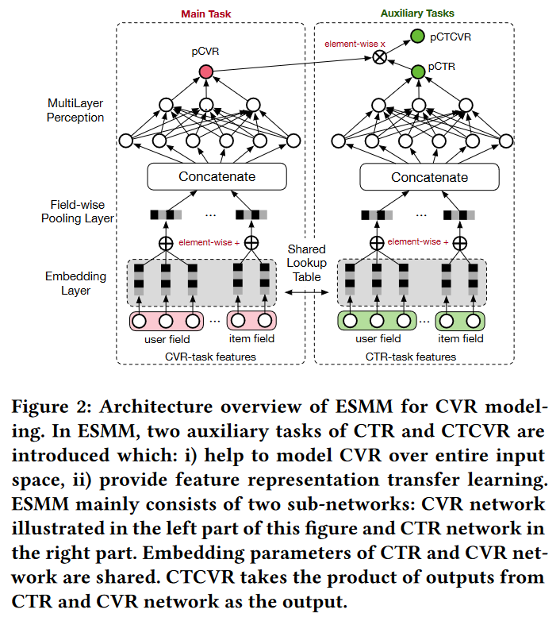

---

---

## 1. 引言

转化率 (CVR) 是推荐系统中平衡用户点击偏好和购买偏好的重要因素。本文专注于点击后CVR估计的任务。为了简化讨论，我们以电子商务网站推荐系统中的CVR建模为例。

给定推荐的商品，用户可能会点击感兴趣的商品并进一步购买其中的一些。换句话说，用户行为遵循曝光→点击→转化的顺序模式。因此，CVR建模指的是估计点击后转化率的任务，即 $p_{cvr}=p(conversion|click,impression)$。

> 点击率CTR预测: $p_{ctr}=p(click|impression)$

### 1.1 关键挑战

#### 1.1.1 样本选择偏差

转化是在点击之后才“有可能”发生的动作，传统CVR模型通常以点击数据为训练集，其中点击未转化为负例，点击并转化为正例。但是训练好的模型实际使用时，则是对整个空间的样本进行预估，而非只对点击样本进行预估。即训练数据与实际要预测的数据来自不同分布，这个偏差对模型的泛化能力构成了很大挑战，导致模型上线后，线上业务效果往往一般。

样本选择偏差 (Sample Selection Bias, SSB)，通常指在数据分析中，由于样本选择的非随机性导致样本不能代表总体，从而使得统计推断产生偏差的现象

- 通用缓解策略
    - 随机抽样：确保样本是从总体中随机选取的，以减少偏差。
    - 加权方法：如果已知样本选择的概率，可以通过加权来调整样本以反映总体特征。
    - 匹配方法：使用倾向得分匹配（Propensity Score Matching）等方法，为每个样本找到一个或多个类似的对照样本。

#### 1.1.2 数据稀疏性

CVR预估任务的使用的训练数据（即点击样本）远小于CTR预估训练使用的曝光样本。仅使用数量较小的样本进行训练，会导致深度模型拟合困难。

- 通用缓解策略
    - 从曝光集中对unclicked样本抽样做负例
    - 对转化样本过采样

#### 1.1.3 延迟反馈

## 2. ESMM

> 论文: Entire Space Multi-Task Model: An Effective Approach for Estimating Post-Click Conversion Rate
>
> 地址: https://arxiv.org/pdf/1804.07931
>
> 发布：SIGIR 2018

前置知识

> 点击转化CTCVR预测: $p_{ctcvr}=p(conversion|impression)$
>
> $p_{ctcvr}(y=1,z=1|x)=p_{ctr}(y=1|x)*p_{cvr}(z=1|y=1,x)$

ESMM模型是一种多任务学习模型，通过学习CTR、CTCVR两个预估任务，根据上式可以隐式地学习到CVR任务，其模型框架如下：

- Embedding层共享参数，MLP层各自任务独享参数
    - ESMM通过共享CTR网络和CVR网络的嵌入参数，利用CTR任务中更丰富的样本来帮助CVR网络学习特征表示，这有助于缓解数据稀疏（DS）问题
- 隐式学习 $p_{cvr}$ ，没有对其构建监督信号
    - 损失函数：$L(\theta_{c\upsilon r},\theta_{ctr}) =\sum_{i=1}^{N}l\left(y_{i},f(x_{i};\theta_{ctr})\right) +\sum_{i=1}^{N}l\left(y_{i}\&z_{i},f(x_{i};\theta_{ctr})\times f(x_{i};\theta_{cvr})\right)$
    - 整个样本空间上建模，不是仅在点击的样本上训练模型

## 3. ESCM^2^

> 题目：ESCM^2 : Entire Space Counterfactual Multi-Task Model for Post-Click Conversion Rate Estimation
>
> 地址：https://arxiv.org/pdf/2204.05125
>
> 发表：SIGIR 2022 

